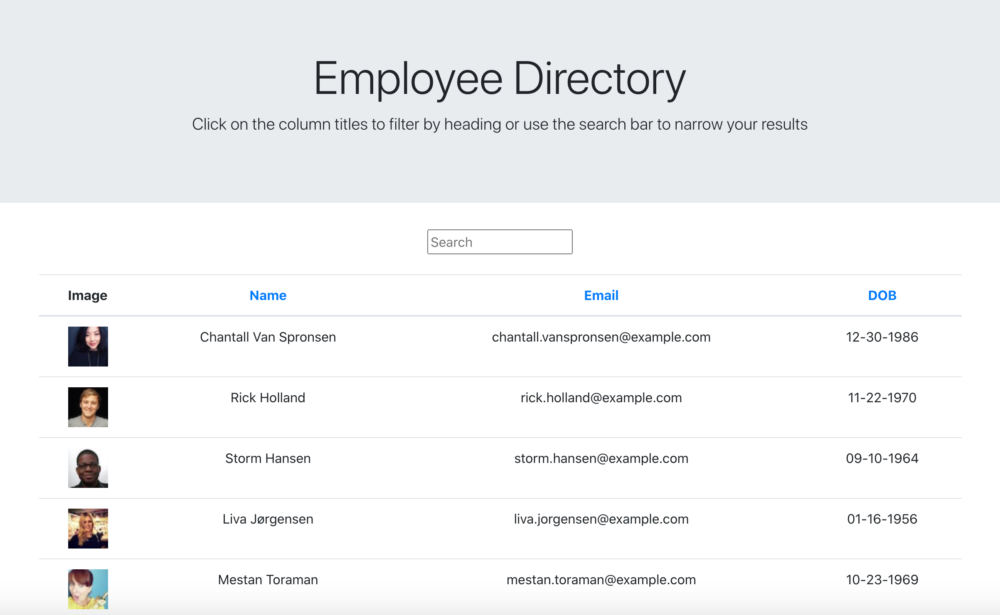

# Employee-Directory

## Table of Contents

- [Description](#description)
- [Installation](#installation)
- [Usage](#usage)
- [Visuals](#visuals)
- [Deployment](#deployment)
- [Contributing](#contributing)
- [Support](#support)

## Description

Employee-Directory is an interactive React application that allows users to view and filter through non-sensitive information about a company's employees.

## Installation

This application requires the following node packages:

- React
- Fetch
- Moment
- GH-Pages

To install, run "npm install" in your Command Line System.

## Usage

To use this application, run the command "npm start" in your CLS. You will then be directed to the designated port in your browser.

## Visuals

## Deployed Application

https://barrettpope.github.io/Employee-Directory/

## Contributing

Pull requests are welcome. For major changes, please open an issue first to discuss what you would like to change.

## Support

For questions, comments or concerns regarding the Employee-Directory application, please email barrettpope94@gmail.com.
